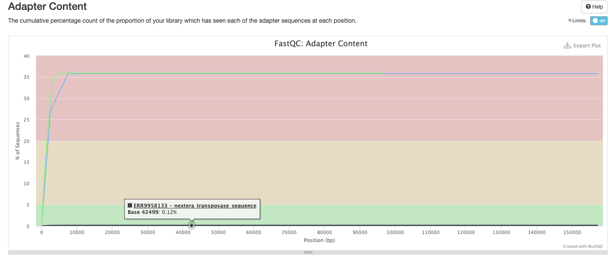

# nf-core/scnanoseq: Output

## Introduction

This document describes the output produced by the pipeline. Most of the plots are taken from the MultiQC report, which summarises results at the end of the pipeline.

The directories listed below will be created in the results directory after the pipeline has finished. All paths are relative to the top-level results directory.

<!-- TODO nf-core: Write this documentation describing your workflow's output -->

## Pipeline overview

The pipeline is built using [Nextflow](https://www.nextflow.io/) and processes data using the following steps:

- [Preprocessing](#preprocessing)
  - [Nanofilt](#nanofilt) - Read Quality Filtering and Trimming
- [Barcode Calling](#barcode-calling)
  - [BLAZE](#blaze) - Barcode caller
- [Alignment](#alignment)
  - [Minimap2](#minimap2) - Long read alignment
- [Alignment Post-processing](#alignment-post-processing)
  - [Samtools](#samtools) - Sort and index alignments and make alignment qc
  - [Barcode Correction](#barcode-correction) - Barcode whitelist correction
  - [UMI Deduplication](#umi-deduplication) - UMI-based deduplication
- [Feature-Barcode Quantification](#feature-barcode-quantification)
  - [IsoQuant](#isoquant) - Feature-barcode quantification
  - [Seurat](#seurat) - Feature-barcode matrix QC
- [Quality Control](#quality-control)
  - [FastQC](#fastqc) - Fastq QC
  - [Nanocomp](#nanocomp) - Long Read Fastq QC
  - [Nanoplot](#nanoplot) - Long Read Fastq QC
  - [RSeQC](#rseqc) - Various RNA-seq QC metrics
  - [MultiQC](#multiqc) - Aggregate report describing results and QC from the whole pipeline
- [Pipeline information](#pipeline-information) - Report metrics generated during the workflow execution

## Preprocessing
### Nanofilt

Output files

- `<sample_identifier>/`
  - `fastq/`
    - `trimmed_nanofilt/`
      - `*_filtered.fastq.gz`

[Nanofilt](https://github.com/wdecoster/nanocomp) is a tool used for filtering and trimming of long read sequencing data.

## Barcode Calling
### BLAZE

Output files

- `<sample_identifier>/`
  - `blaze/`
    - `blaze/*.bc_count.txt`
    - `blaze/*.knee_plot.png`
    - `blaze/*.putative_bc.csv`
    - `blaze/*.whitelist.csv`

[BLAZE](https://github.com/shimlab/BLAZE) enables the accurate identification of barcodes and UMIs from Nanopore reads.

## Alignment
### Minimap2

Output files

- `<sample_identifier>/`
  - `bam/`
    - `original/`
      - `*.sorted.bam`
      - `*.sorted.bam.bai`

[Minimap2](https://github.com/lh3/minimap2) is a versatile sequence alignment program that aligns DNA or mRNA sequences against a large reference database. Minimap2 is optimized for large, noisy reads making it a staple for alignment of nanopore reads

## Alignment Post-processing
### Samtools

Output files

- `<sample_identifier>/`
  - `bam/`
    - `mapped_only/`
      - `*.sorted.bam`
      - `*.sorted.bam.bai`
  - `qc/`
    - `samtools/`
      - `mapped_only/`
        - `*.mapped_only.flagstat`
        - `*.mapped_only.idxstats`
        - `*.mapped_only.stats`
      - `minimap/`
        - `*.mapped_only.flagstat`
        - `*.mapped_only.idxstats`
        - `*.mapped_only.stats`

### Barcode Correction

Output files

- `<sample_identifier>/`
  - `bam/`
    - `corrected/`
      - `*.corrected.bam`
      - `*.corected.bam.bai`

Barcode correction is a custom script that uses the whitelist generated by BLAZE in order to correct barcodes that are not on the whitelist into a whitelisted barcode.

### UMI Deduplication

Output files

- `<sample_identifier>/`
  - `bam/`
    - `dedup/`
      - `*.dedup.bam`
      - `*.dedup.bam.bai`

[UMI-Tools](https://umi-tools.readthedocs.io/en/latest/reference/dedup.html) deduplicate reads based on the mapping co-ordinate and the UMI attached to the read. The identification of duplicate reads is performed in an error-aware manner by building networks of related UMIs 

## Feature-Barcode Quantification
### IsoQuant

Output files

- `<sample_identifier>/`
  - `bam/`
    - `dedup/`
      - `*.dedup.bam`
      - `*.dedup.bam.bai`

### Seurat

## Quality Control
### FastQC

Output files

- `<sample_identifier>/`
  - `qc/`
    - `fastqc/`
      - `pre_trim/`
        - `*_fastqc.html`: FastQC report containing quality metrics.
        - `*_fastqc.zip`: Zip archive containing the FastQC report, tab-delimited data file and plot images.
      - `post_extract/`
        - `*_fastqc.html`: FastQC report containing quality metrics.
        - `*_fastqc.zip`: Zip archive containing the FastQC report, tab-delimited data file and plot images.

[FastQC](http://www.bioinformatics.babraham.ac.uk/projects/fastqc/) gives general quality metrics about your sequenced reads. It provides information about the quality score distribution across your reads, per base sequence content (%A/T/G/C), adapter contamination and overrepresented sequences. For further reading and documentation see the [FastQC help pages](http://www.bioinformatics.babraham.ac.uk/projects/fastqc/Help/).

> **NB:** The FastQC plots displayed in the MultiQC report shows _untrimmed_ reads. They may contain adapter sequence and potentially regions with low quality.

### Nanocomp

Output files

- `batch_qcs/`
  - `nanocomp/`
    - `fastq/`
      - `NanoComp_*.log`
      - `NanoComp_lengths_violin.html`
      - `NanoComp_log_length_violin.html`
      - `NanoComp_N50.html`
      - `NanoComp_number_of_reads.html`
      - `NanoComp_OverlayHistogram.html`
      - `NanoComp_OverlayHistogram_Normalized.html`
      - `NanoComp_OverlayLogHistogram.html`
      - `NanoComp_OverlayLogHistogram_Normalized.html`
      - `NanoComp_quals_violin.html`
      - `NanoComp-report.html`
      - `NanoComp_total_throughput.html`
      - `NanoStats.txt`
    - `bam/`
      - `NanoComp_20240212_1942.log`
      - `NanoComp_lengths_violin.html`
      - `NanoComp_log_length_violin.html`
      - `NanoComp_N50.html`
      - `NanoComp_number_of_reads.html`
      - `NanoComp_OverlayHistogram.html`
      - `NanoComp_OverlayHistogram_Identity.html`
      - `NanoComp_OverlayHistogram_Normalized.html`
      - `NanoComp_OverlayHistogram_PhredScore.html`
      - `NanoComp_OverlayLogHistogram.html`
      - `NanoComp_OverlayLogHistogram_Normalized.html`
      - `NanoComp_percentIdentity_violin.html`
      - `NanoComp_quals_violin.html`
      - `NanoComp-report.html`
      - `NanoComp_total_throughput.html`
      - `NanoStats.txt`

[Nanocomp](https://github.com/wdecoster/nanocomp) compares multiple runs of long read sequencing data and alignments. It creates violin plots or box plots of length, quality and percent identity and creates dynamic, overlaying read length histograms and a cumulative yield plot

### Nanoplot

Output files

- `<sample_identifier>/`
  - `fastq/`
    - `trimmed_nanofilt/`
      - `*_filtered.fastq.gz`

[Nanoplot](https://github.com/wdecoster/NanoPlot) is a plotting tool for long read sequencing data and alignments.

### MultiQC

Output files

- `multiqc/`
  - `multiqc_report.html`: a standalone HTML file that can be viewed in your web browser.
  - `multiqc_data/`: directory containing parsed statistics from the different tools used in the pipeline.
  - `multiqc_plots/`: directory containing static images from the report in various formats.

[MultiQC](http://multiqc.info) is a visualization tool that generates a single HTML report summarising all samples in your project. Most of the pipeline QC results are visualised in the report and further statistics are available in the report data directory.

Results generated by MultiQC collate pipeline QC from supported tools e.g. FastQC. The pipeline has special steps which also allow the software versions to be reported in the MultiQC output for future traceability. For more information about how to use MultiQC reports, see <http://multiqc.info>.

### Pipeline information

Output files

- `pipeline_info/`
  - Reports generated by Nextflow: `execution_report.html`, `execution_timeline.html`, `execution_trace.txt` and `pipeline_dag.dot`/`pipeline_dag.svg`.
  - Reports generated by the pipeline: `pipeline_report.html`, `pipeline_report.txt` and `software_versions.yml`. The `pipeline_report*` files will only be present if the `--email` / `--email_on_fail` parameter's are used when running the pipeline.
  - Reformatted samplesheet files used as input to the pipeline: `samplesheet.valid.csv`.

[Nextflow](https://www.nextflow.io/docs/latest/tracing.html) provides excellent functionality for generating various reports relevant to the running and execution of the pipeline. This will allow you to troubleshoot errors with the running of the pipeline, and also provide you with other information such as launch commands, run times and resource usage.
